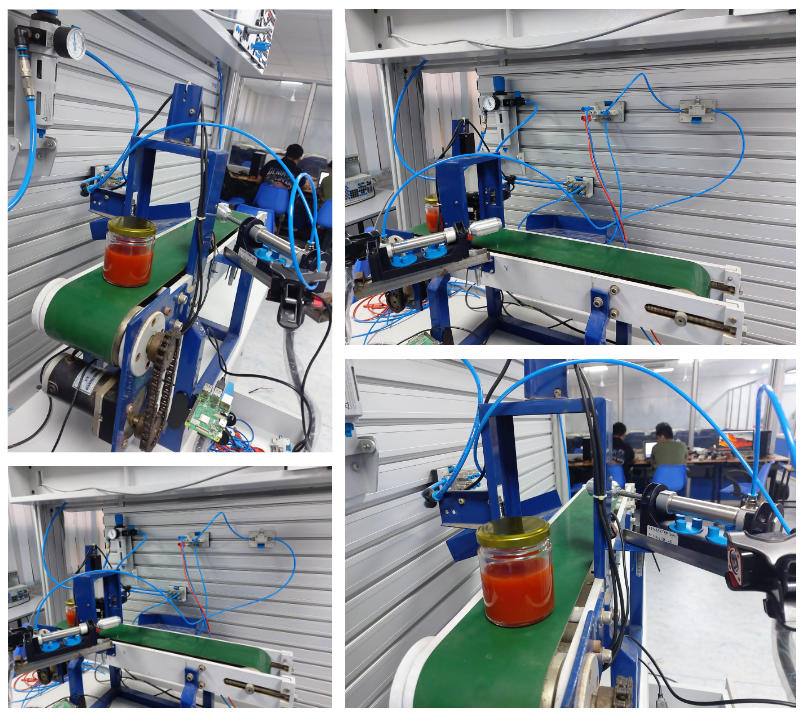
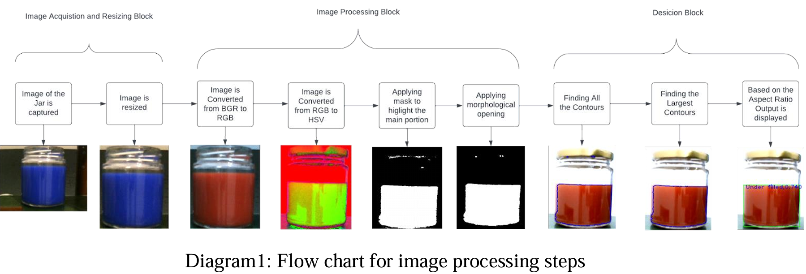

# Smart Conveyor Belt for Honey Jar Detection and Sorting

This project presents a smart conveyor belt system designed for honey jar detection and sorting. The system leverages YOLOv5 for object detection and ESP32 microcontrollers for real-time monitoring and sorting, with all devices connected wirelessly via a local Wi-Fi network.

## System Overview

### Components
The system comprises three primary components:
1. **Main Computer (Laptop/Raspberry Pi):** Handles honey jar detection using YOLOv5 and processes the camera feed for image analysis.
2. **ESP32-CAM Microcontroller:** Captures real-time video of the conveyor belt and streams it to the main computer via RTSP.
3. **ESP32 Sorting Microcontroller:** Receives sorting commands from the main computer and activates a pneumatic mechanism to handle defective jars.

### Detection Logic
The main computer processes the camera feed to identify:
- **Liquid level inside jars** using image processing techniques.
- **Cap condition** and **label integrity** of jars.

When anomalies are detected, the sorting microcontroller receives commands over the local Wi-Fi network to execute appropriate actions.

### Setup Diagram


### Level Detection Logic


## Key Features

- **Real-time detection** of jar conditions using YOLOv5.
- **Liquid level monitoring** inside jars.
- **Cap and label defect detection** with corresponding sorting actions.
- **Wireless video streaming** from the ESP32-CAM to the main computer.
- **Socket-based communication** between the main computer and the sorting ESP32.
- **Pneumatic sorting mechanism** for handling defective jars.

## Prerequisites

Ensure the following are available before running the project:

- A main computer (laptop) with Python installed.
- Two ESP32 microcontrollers:
  - **ESP32-CAM** for video capture.
  - **Second ESP32** for sorting control.
- A stable local Wi-Fi network for communication.
- Required Python libraries (specified in `requirements.txt`).

## Installation

1. Clone the repository:
   ```bash
   git clone https://github.com/PranayLendave/industry4.0-with-yolov5-and-esp32.git
   ```
2. Install the necessary Python dependencies:
   ```bash
   pip install -r requirements.txt
   ```
3. Configure the ESP32-CAM for RTSP streaming.
4. Set up the second ESP32 with the provided firmware for sorting actions.
5. Connect all devices to the same Wi-Fi network.

## Usage

1. Start the Python program on the main computer by running `main.py`.
    ```bash
   python main.py
   ```
3. Ensure the ESP32-CAM is streaming video to the main computer via RTSP.
4. Monitor the real-time detection output on the main computer.
5. Upon detecting any anomalies, the main computer sends sorting commands to the second ESP32.
6. The second ESP32 activates the pneumatic sorting mechanism to separate defective jars.

## Contributors

Major contributors:
- [Viral Faria](https://github.com/viralfaria)
- [Pranay Lendave](https://github.com/PranayLendave)

Contributions are welcome! If you encounter any issues or have suggestions for improvements, feel free to submit a bug report or feature request via the issue tracker.

---
This project is a step towards Industry 4.0 automation by integrating advanced object detection and IoT-enabled control systems for smart manufacturing.

